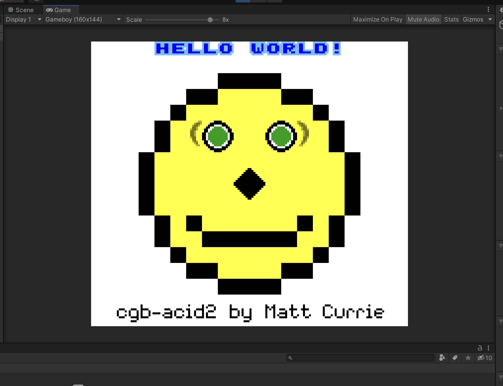

# gameboyunity
A Gameboy Color emulator written using Unity3D/C#

Passes Blragg's test CPU instruction/timing test. Passes some of Mooneye's test cases. The audio *works*, but there is room for improvements.

# Screenshots of the emulator running
